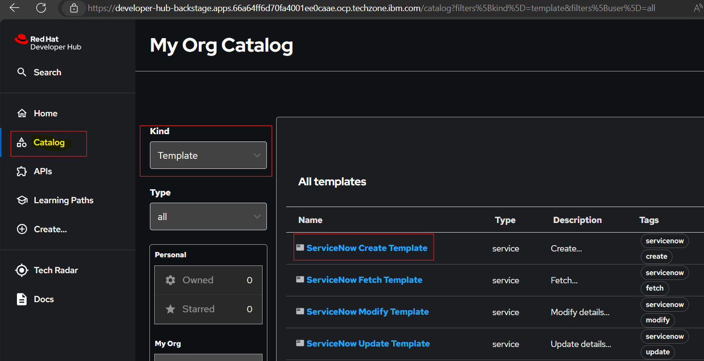
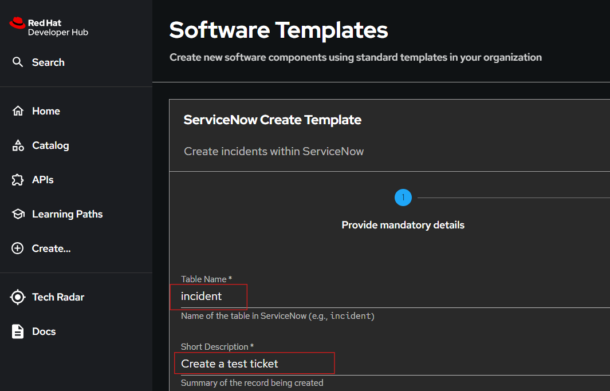

# ServiceNow Create Template

Launch ServiceNow Create Template for create a new ticket in SNOW.

## 1. Launch template

## 2. Provide table name (ticket type e.g. incident, change) and Short description of the issue or request which you want to create.

## 3. Click on **Review** verify detaila and Click on **Create** to create the ticket.
